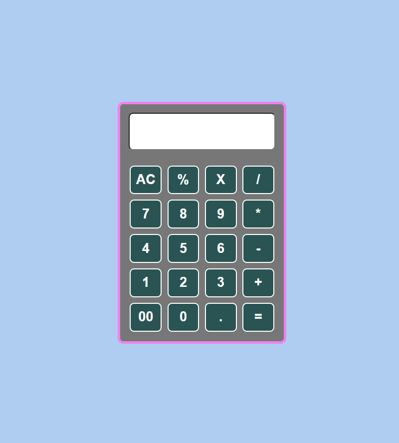
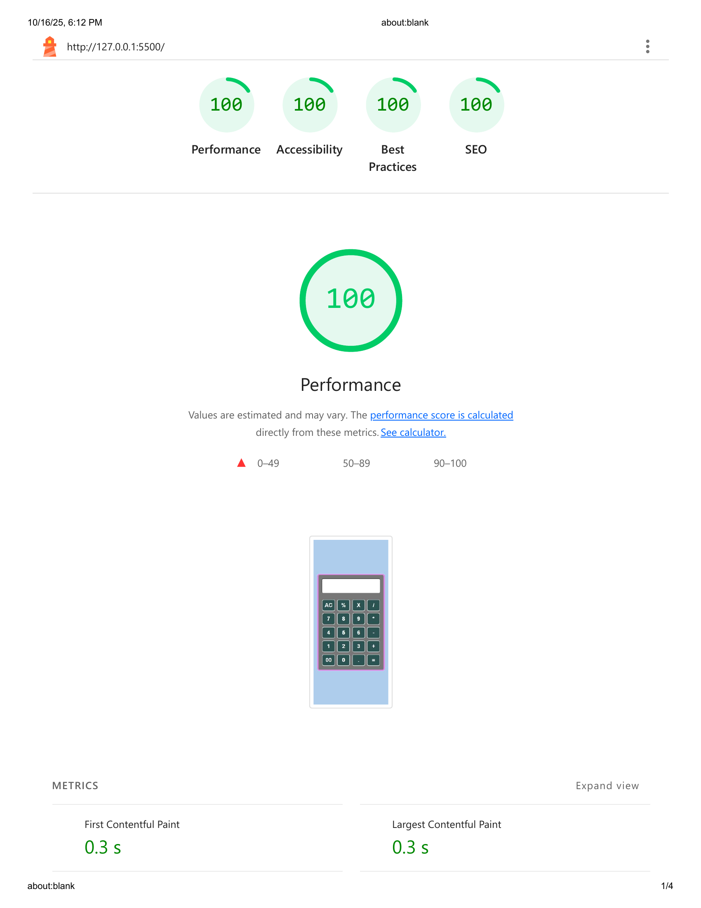

# 🧮 Simple Calculator App

A simple and functional calculator built with **HTML**, **CSS**, and **JavaScript (Vanilla JS)**.  
This project demonstrates clean DOM manipulation, event delegation, and basic arithmetic logic handling.

---

## 🌐 Live Demo

👉 [View Demo on GitHub Pages]([https://github.com/ahmednabil22224/Standart-Calculator/](https://ahmednabil22224.github.io/Standart-Calculator/))

---
## 🚀 Screenshot



---

## ✨ Features

- Basic arithmetic operations: `+`, `-`, `*`, `/`, `%`
- Prevents invalid inputs (e.g., multiple dots or consecutive operators)
- Handles division by zero gracefully
- Keyboard-safe (no user typing — uses on-screen buttons only)
- Responsive layout using CSS Grid

---

## 🛠️ Technologies Used

- **HTML5**
- **CSS3**
- **JavaScript (ES6)**

---

## 📊 Lighthouse Report

| Category       | Score |
| -------------- | ----- |
| Performance    | 100%  |
| Accessibility  | 100%  |
| Best Practices | 100%  |
| SEO            | 100%  |



## 📁 Project Structure

```
📦 calculator-app
┣ 📂 css
┃ ┗ style.css
┣ 📂 js
┃ ┗ main.js
┣📂 images
┃ ┗ lighthouse-report.png
┃ ┗ simple-calculator.png
┣ 📜 index.html
┗ 📜 README.md
```

---

## ⚙️ How to Run

1. Clone the repository:
   ```bash
   git clone https://github.com/ahmednabil22224/Standart-Calculator.git
   ```

2.Open index.html directly in your browser.

# 💡 No build tools needed — pure vanilla JS.

# Standart-Calculator
